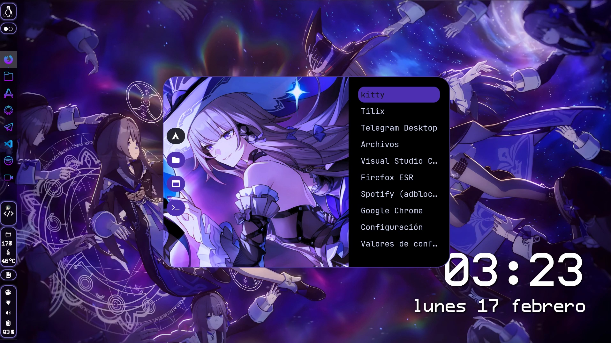
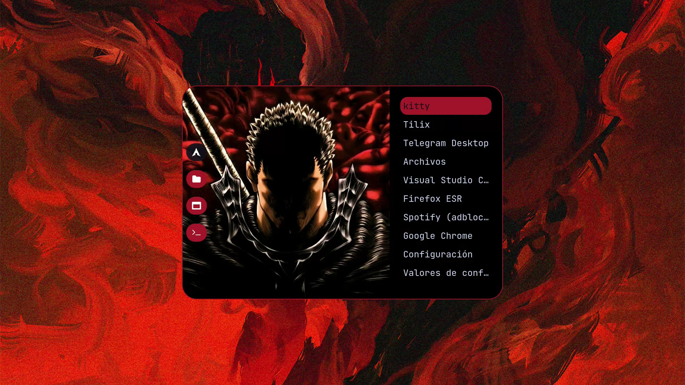
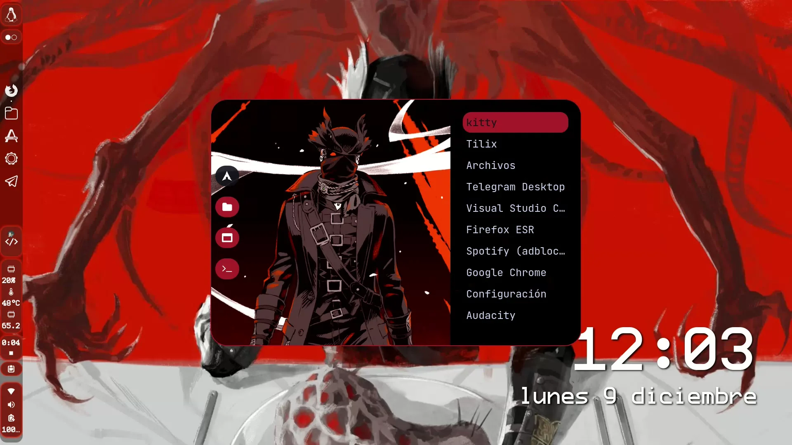
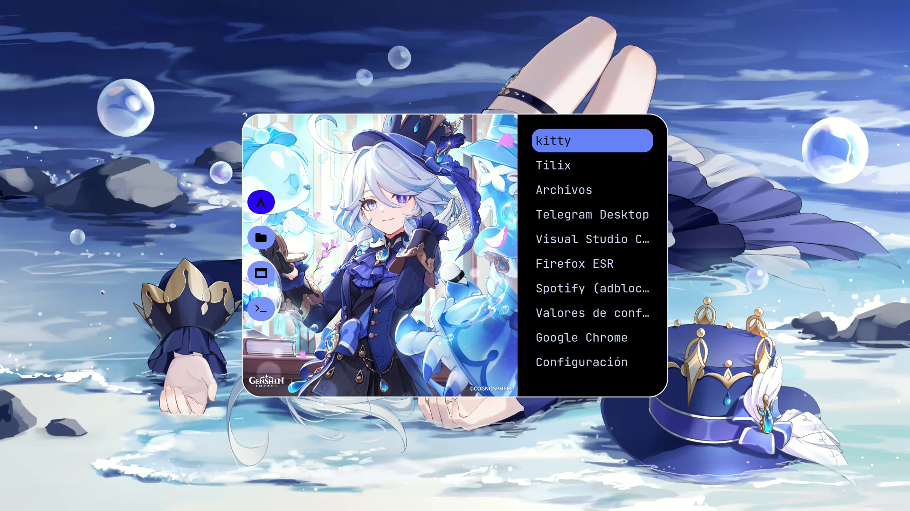

<h1 align="center">My Anime inspired ROFI configs</h1>

### Tabla de contenido

- [Requisitos]
  - Have ROFI installed

- [Instalación || Install]

  Clonar el repo || Clone the repo
```
  bash 
  $ git clone https://github.com/Zerabalus/Rofi-config.git
```

## Instalacion Esp.
- Pega toda la carpeta en tu folder de rofi, por ejemplo la mía esta en ~/.config/rofi
- Luego basta con cambiar los nombres por config y la terminación .txt por .rasi con el que más te guste así como el directorio de donde se encontrarían las imágenes:

```
 background-image:         url("/home/epharedam(este es mi nombre de usuario)/.config/rofi/img/xiaob.jpeg", height);
```


## Installation Eng.
- Paste the whole content in your rofi folder, for example mine is in ~/.config/rofi
- Change the names that have .txt with .rasi and the name to config to the one you choose and also the directory of the images to fit yours, as an example most url are:

```
 background-image:         url("/home/epharedam(change this since this is my user)/.config/rofi/img/xiaob.jpeg", height);
```

### Temas|Themes
- Hacker (Akudama Drive)
- Yatora Yaguchi (Blue Period)
- Lloyd de Saloum (I Was Reincarnated as the 7th Prince so I Can Take My Time Perfecting My Magical Ability)
- Avilio Bruno (91 days)
- Hunter (Bloodborne)
- The Herta (Honkai Star Rail)
- Guts (Berserk)
- Furina (Genshin Impact)
- Xiao (Genshin Impact)
- Sunday (Honkai Star Rail)


### Previews 

- I'll be updating the previews, all work but sometimes I change everything and forget to take the screenshots lol










  
